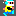
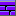
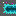
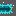

## Mô tả về Project
*Dự án được lấy cảm hứng từ trò chơi nổi tiếng Bomberman của công ty Hudson Soft*

## Sinh viên thực hiện 

| Họ và tên     | Mã sinh viên |
| ------------- | ------------ |
| [Chu Ngọc Vượng](https://github.com/Iktomi921) | 21020674     |
| [Hoàng Thái Quang](https://github.com/htq-uet)  | 21020229     |
| [Lê Viết Việt Linh](https://github.com/anhbanlinhle) | 21020644     |

## Điều khiển
- Game hoàn toàn điều khiển bằng bàn phím.
- Trong Menu: sử dụng `W`, `S` để di chuyển giữa các chế độ chơi, `Enter` để chọn.
- Đối với Bomber sử dụng các phím `W`, `A`, `S`, `D` tương ứng với đi lên, trái, xuống, phải. `Space` để đặt bomb.
- Trong Game: sử dụng `Esc` để dừng game

## Mô tả về các đối tượng trong trò chơi

*Trò chơi được xây dựng dựa trên ngôn ngữ Java*

-  *Bomber* là nhân vật chính của trò chơi. Bomber có thể di chuyển theo 4 hướng trái/phải/lên/xuống bằng cách bấm A/D/W/S. 
-  *Enemy* là các đối tượng mà Bomber phải tiêu diệt hết để có thể qua Level. Enemy có thể di chuyển ngẫu nhiên hoặc tự đuổi theo Bomber tùy theo loại Enemy. Các loại Enemy sẽ được mô tả cụ thể ở phần dưới.
-  *Bomb* là đối tượng mà Bomber sẽ đặt và kích hoạt tại các ô Grass. Khi đã được kích hoạt, Bomber và Enemy không thể di chuyển vào vị trí Bomb. Tuy nhiên ngay khi Bomber vừa đặt và kích hoạt Bomb tại ví trí của mình, Bomber có một lần được đi từ vị trí đặt Bomb ra vị trí bên cạnh. Sau khi kích hoạt 2s, Bomb sẽ tự nổ, các đối tượng *Flame*  được tạo ra.

-  *Grass* là đối tượng mà Bomber và Enemy có thể di chuyển xuyên qua, và cho phép đặt Bomb lên vị trí của nó
-  *Wall* là đối tượng cố định, không thể phá hủy bằng Bomb cũng như không thể đặt Bomb lên được, Bomber và Enemy không thể di chuyển vào đối tượng này
-  *Brick* là đối tượng được đặt lên các ô Grass, không cho phép đặt Bomb lên nhưng có thể bị phá hủy bởi Bomb được đặt gần đó. Bomber và Enemy thông thường không thể di chuyển vào vị trí Brick khi nó chưa bị phá hủy.

-  *Portal* là đối tượng được giấu phía sau một đối tượng Brick. Khi Brick đó bị phá hủy, Portal sẽ hiện ra và nếu tất cả Enemy đã bị tiêu diệt thì người chơi có thể qua Level khác bằng cách di chuyển vào vị trí của Portal.

## Mô tả về Item
Các *Item* được giấu phía sau Brick và chỉ hiện ra khi Brick bị phá hủy. Bomber có thể sử dụng Item bằng cách di chuyển vào vị trí của Item. 

Thông tin về chức năng của các Item được liệt kê như dưới đây:
-  *SpeedItem* Khi sử dụng Item này, Bomber sẽ được tăng vận tốc di chuyển thêm một giá trị thích hợp

-  *FlameItem* Item này giúp tăng phạm vi ảnh hưởng của Bomb khi nổ (độ dài các Flame lớn hơn)

-  *BombItem* Thông thường, nếu không có đối tượng Bomb nào đang trong trạng thái kích hoạt, Bomber sẽ được đặt và kích hoạt duy nhất một đối tượng Bomb. Item này giúp tăng số lượng Bomb có thể đặt thêm một.

## Mô tả về Enemy
-  *Balloom* di chuyển đơn giản và có tốc độ nhanh nhất 

-  *Oneal* di chuyển thông minh hơn tuy nhiên có tốc độ chậm hơn

-  *Doll* có thể thu hẹp bản thân để di chuyển qua những tấm gạch

-  *Ghest* nếu lại gần Bomber sẽ trở thành một bóng ma bất tử  đổi lại là tốc độ chậm hơn, nếu rời xa Bomber sẽ quay lại trạng thái và tốc độ bình thường 

-  *Eggs* là một đối thủ khó chịu, nếu bị tiêu diệt sẽ sinh ra 2  *Eggs Bomb*, điều tương tự xảy ra khi tiêu diệt *Eggs Bomb*, nếu có hơn 5 *Eggs Bomb* cùng tồn tại thì Bomber thua cuộc

-  *Batfs* có thể bay lên cao, từ đó nhìn ra đường đi và tìm đường đến tới Bomber,

## Mô tả gameplay, xử lý va chạm và xử lý bom nổ
- Trong một màn chơi, Bomber sẽ được người chơi di chuyển, đặt và kích hoạt Bomb với mục tiêu chính là tiêu diệt tất cả Enemy và tìm ra vị trí Portal để có thể qua màn mới
- Bomber sẽ bị giết khi va chạm với Enemy hoặc thuộc phạm vi Bomb nổ. Lúc đấy trò chơi kết thúc.
- Enemy bị tiêu diệt khi thuộc phạm vi Bomb nổ 
- Một đối tượng thuộc phạm vi Bomb nổ có nghĩa là đối tượng đó va chạm với một trong các tia lửa được tạo ra tại thời điểm một đối tượng Bomb nổ.

- Khi Bomb nổ, một Flame trung tâm tại vị trí Bomb nổ và bốn Flame tại bốn vị trí ô đơn vị xung quanh vị trí của Bomb xuất hiện theo bốn hướng trên/dưới/trái/phải. Độ dài bốn Flame xung quanh mặc định là 1 đơn vị, được tăng lên khi Bomber sử dụng các FlameItem.
- Khi các Flame xuất hiện, nếu có một đối tượng thuộc loại Brick/Wall nằm trên vị trí một trong các Flame thì độ dài Flame đó sẽ được giảm đi để sao cho Flame chỉ xuất hiện đến vị trí đối tượng Brick/Wall theo hướng xuất hiện. Lúc đó chỉ có đối tượng Brick/Wall bị ảnh hưởng bởi Flame, các đối tượng tiếp theo không bị ảnh hưởng. Còn nếu vật cản Flame là một đối tượng Bomb khác thì đối tượng Bomb đó cũng sẽ nổ ngay lập tức.
